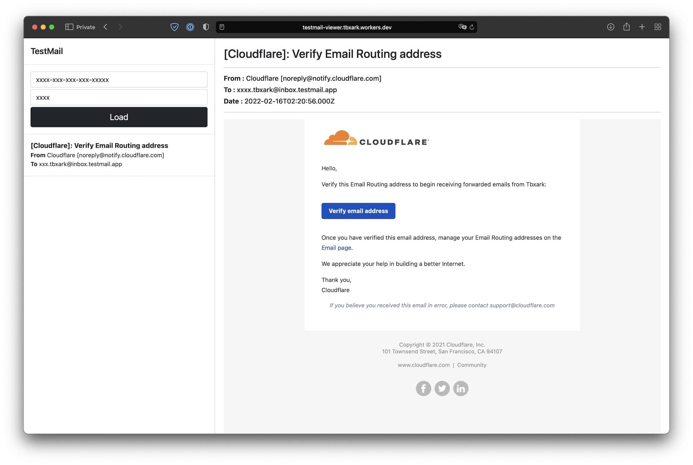

# TestMail Viewer

[TestMail](https://testmail.app) 免费版不支持在线预览邮件，只能支持在线预览 json，所以使用起来有点麻烦，所以就有了这个在线预览 TestMail 的工具。
使用下面的链接就可以直接预览邮件，支持富文本。

```
https://testmail.pages.dev
```



## 部署

1. 此项目使用 [Cloudflare Pages](https://pages.cloudflare.com/) 部署，所以你需要一个 Cloudflare 账号。
2. 先Fork此项目，然后在 Cloudflare Pages 中创建一个项目，选择此项目的仓库链接即可。

<details>
  <summary>Cloudflare Pages 编译配置如下</summary> 
  
</details>

